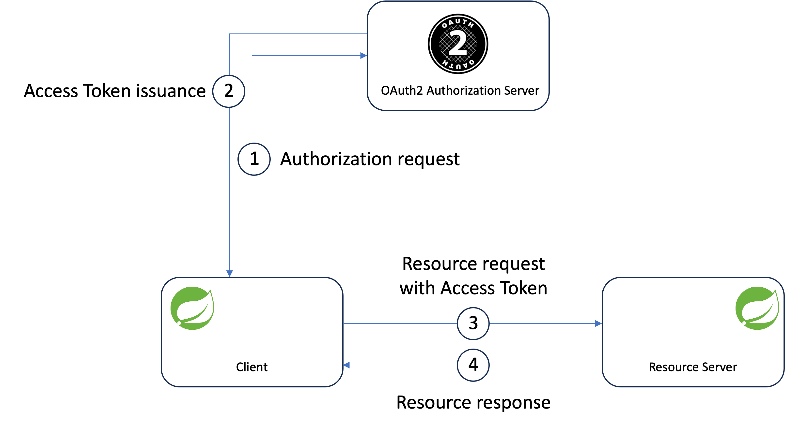
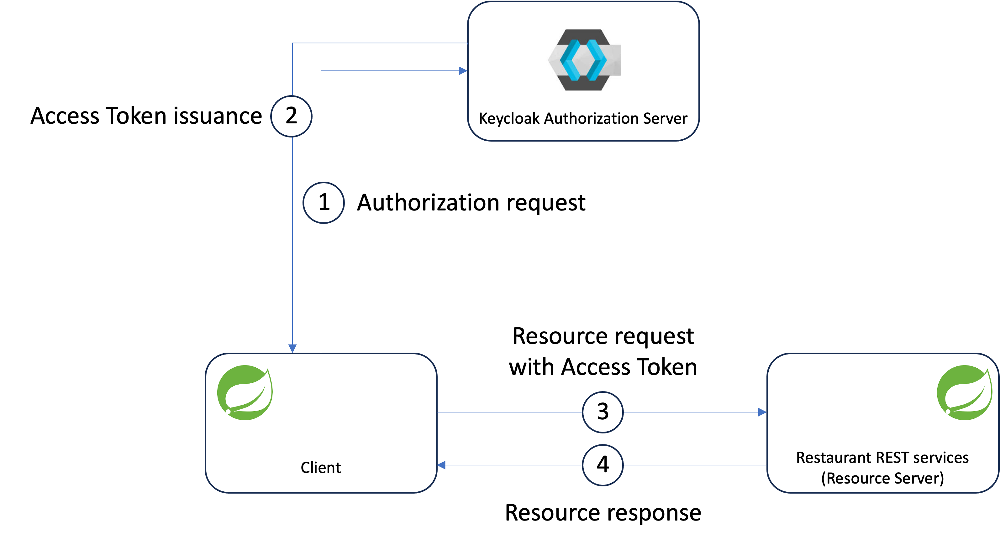

# Windfire Security
- [Introduction](#introduction)
- [OAuth2](#OAuth2)
    - [Keycloak](#Keycloak)

## Introduction
This repository contains code, scripts and various artifacts related to security implementation for Windfire applications.

## OAuth2
OAuth2 plays a pivotal role in securing APIs and applications by providing a standardized way of handling authentication.

OAuth2 defines four roles (as described in https://datatracker.ietf.org/doc/html/rfc6749#section-1.1):
* **Resource Owner**: An entity capable of granting access to a protected resource. When the resource owner is a person, it is referred to as an end-user.
* **Resource server**: The server hosting the protected resources, capable of accepting and responding to protected resource requests using access tokens.
* **Client**: An application making protected resource requests on behalf of the resource owner and with its authorization. The term "client" does not imply any particular implementation characteristics (e.g., whether the application executes on a server, a desktop, or other devices).
* **Authorization server**: The server issuing access tokens to the client after successfully authenticating the resource owner and obtaining authorization.

Conceptually, an OAuth2 enabled architecture looks like the following picture.

### Keycloak
Keycloak is an Open Source Identity and Access Management technology that allows to add authentication mechanisms to applications, securing them with minimum effort.

Keycloak provides user federation, strong authentication, user management, fine-grained authorization, and more.

As we all modern technologies, Keycloak can be deployed in different way, the easiest way for my purposes is to use the Docker.

A comprehensive guide on how to run Keycloak in Docker is available on Keycloak official website https://www.keycloak.org/getting-started/getting-started-docker.

A convenient script **[start-keycloak.sh](oauth2/keycloak/start-keycloak.sh)** is provided to run Keycloak in
1. Server on localhost
2. Docker container

#### Run Keycloak as server on localhost
In case this option is selected, the script just runs the **<KEYCLOAK_HOME>/bin/kc.sh** command provided by Keycloak; **KEYCLOAK_HOME** needs to be set in **[setenv.sh](setenv.sh)** to point to actual Keycloak installation directory on your platform.

#### Run Keycloak on Docker
In case Docker is selected, Keycloak will run with the following default parameters values:
* **Keycloak Docker Image** set to *quay.io/keycloak/keycloak*
* **Keycloak Docker Image version** set to *23.0.3*
* **Keycloak Container name** set to *keycloak*
* **Keycloak Port** remapped and exposed on *8081*
* **Keycloak Admin console username** rset to *admin*

The script will only require to input the Password for Keycloak Admin console.

With these default values, once the container is running, Keycloak Admin Console will be available at **http://localhost:8081/admin**.