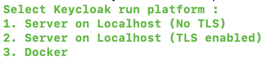
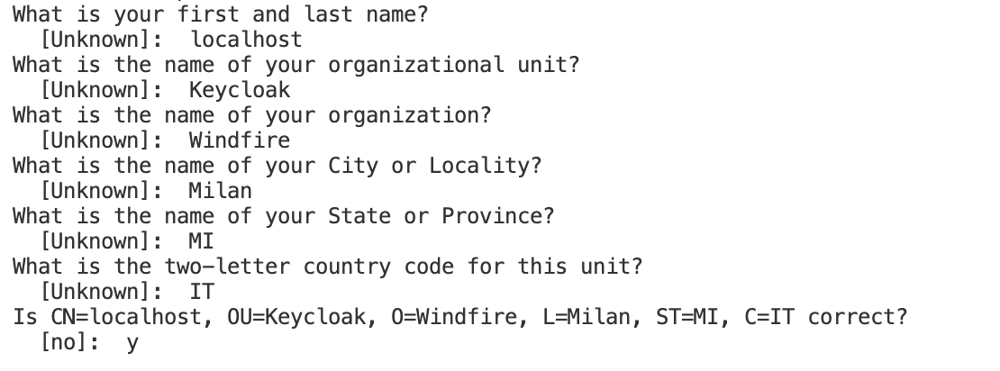
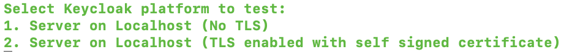

# Windfire Security
- [Introduction](#introduction)
- [Security protocols](#security-protocols)
    - [OAuth2](#OAuth2)
- [Identity and access management](#identity-and-access-management)
    - [Keycloak](#Keycloak)
        - [Run Keycloak as server on localhost](#run-keycloak-as-server-on-localhost)
        - [Secure and run Keycloak server with TLS](#secure-and-run-keycloak-server-with-tls)
        - [Run Keycloak on Docker](#run-keycloak-on-docker)
        - [Test Keycloak functioning](#test-keycloak-functioning)

## Introduction
This repository contains code, scripts and various artifacts related to security implementation for Windfire applications.

## Security protocols
Security protocols are foundational elements of modern IT systems, serving as standardized frameworks for securing communication and data exchange over networks. 

These protocols define rules and procedures that govern authentication, encryption, and data integrity, ensuring confidentiality, integrity, and availability of information. 

By implementing security protocols such as SSL/TLS, SSH, and IPsec, organizations can establish secure connections, authenticate users and devices, and protect against unauthorized access and data breaches. 

Security protocols play a critical role in fortifying IT infrastructures, safeguarding sensitive data, and upholding the trust and integrity of digital interactions.

### OAuth2
OAuth2 is a security protocol playing a pivotal role in securing APIs and applications by providing a standardized way of handling authentication.

OAuth2 defines four roles (as described in https://datatracker.ietf.org/doc/html/rfc6749#section-1.1):
* **Resource Owner**: An entity capable of granting access to a protected resource. When the resource owner is a person, it is referred to as an end-user.
* **Resource server**: The server hosting the protected resources, capable of accepting and responding to protected resource requests using access tokens.
* **Client**: An application making protected resource requests on behalf of the resource owner and with its authorization. The term "client" does not imply any particular implementation characteristics (e.g., whether the application executes on a server, a desktop, or other devices).
* **Authorization server**: The server issuing access tokens to the client after successfully authenticating the resource owner and obtaining authorization.

Conceptually, an OAuth2 enabled architecture looks like the following picture.

## Identity and access management
Identity and Access Management (IAM) systems are fundamental components of modern cybersecurity strategies, providing organizations with the means to manage and control access to their digital resources. 

IAM systems enable businesses to securely authenticate users, grant appropriate permissions, and enforce policies across diverse IT environments. 

By centralizing user identities and access controls, IAM solutions streamline user provisioning, simplify compliance efforts, and mitigate security risks associated with unauthorized access. These systems play a crucial role in safeguarding sensitive data, protecting against insider threats, and ensuring regulatory compliance within organizations.

### Keycloak
Keycloak is an Open Source Identity and Access Management technology that allows to add authentication mechanisms to applications, securing them with minimum effort.

Keycloak provides user federation, strong authentication, user management, fine-grained authorization, and more.

As we all modern technologies, Keycloak can be deployed in different way, the easiest way for my purposes is to use the Docker.

A comprehensive guide on how to run Keycloak in Docker is available on Keycloak official website https://www.keycloak.org/getting-started/getting-started-docker.

A convenient script **[start-keycloak.sh](keycloak/start-keycloak.sh)** is provided to run Keycloak in one of the following mode

#### Run Keycloak as server on localhost
In case *option 1* is selected, the script just runs the **<KEYCLOAK_HOME>/bin/kc.sh** command provided by Keycloak; **KEYCLOAK_HOME** needs to be set in **[setenv.sh](setenv.sh)** to point to actual Keycloak installation directory on your platform.

Keycloak Admin console will respond on http://localhost:8080/admin. The first time you launch it, you will need to create an admin user that will secure all the following accesses, follow the instructions at *https://www.keycloak.org/getting-started/getting-started-zip* to create admin credentials.

#### Secure and run Keycloak server with TLS
Keycloak can be configured to run with SSL enabled, loading the required certificate infrastructure using files in PEM format or from a Java Keystore. When both alternatives are configured, the PEM files takes precedence over the Java Keystores.

I referred to official Keycloak documentation intsructions *https://www.keycloak.org/server/enabletls* to understand how to enable SSL on Keycloak server.

A convenient script **[createSSL.sh](keycloak/security/createSSL.sh)** is provided to generate a server keystore in *ssl* subfolder.

The script currently uses keytool to generate the keystore; once keytool command is launched, asks for some info, my choices are something similar to this following

Once the server keystore has been generated, run **[setupKeycloakMode.sh](keycloak/setupKeycloakMode.sh)**, which provides two options to enable and disable SSL respectively

If *option 1* is selected, the script does the following:

1. it copies server keystore to **<KEYCLOAK_HOME>/conf** folder
2. it runs **<KEYCLOAK_HOME>/bin/kc.sh build** command to rebuild Keycloak configuration and fully enable SSL

**[TODO]**

#### Run Keycloak on Docker
In case Docker is selected, Keycloak will run with the following default parameters values:
* **Keycloak Docker Image** set to *quay.io/keycloak/keycloak*
* **Keycloak Docker Image version** set to *23.0.3*
* **Keycloak Container name** set to *keycloak*
* **Keycloak Port** remapped and exposed on *8081*
* **Keycloak Admin console username** rset to *admin*

The script will only require to input the Password for Keycloak Admin console.

With these default values, once the container is running, Keycloak Admin Console will be available at **http://localhost:8081/admin**.

#### Test Keycloak functioning
A convenient script **[testKeycloak.sh](keycloak/test/testKeycloak.sh)** is provided to run a simple curl command to authenticate with Keycloak and see if everything is setup and works fine.

The script allows to select whether SSL on Keycloak server is enabled or not

